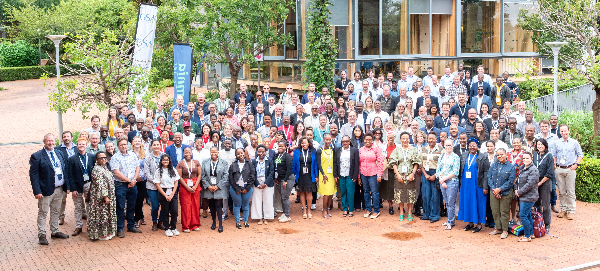
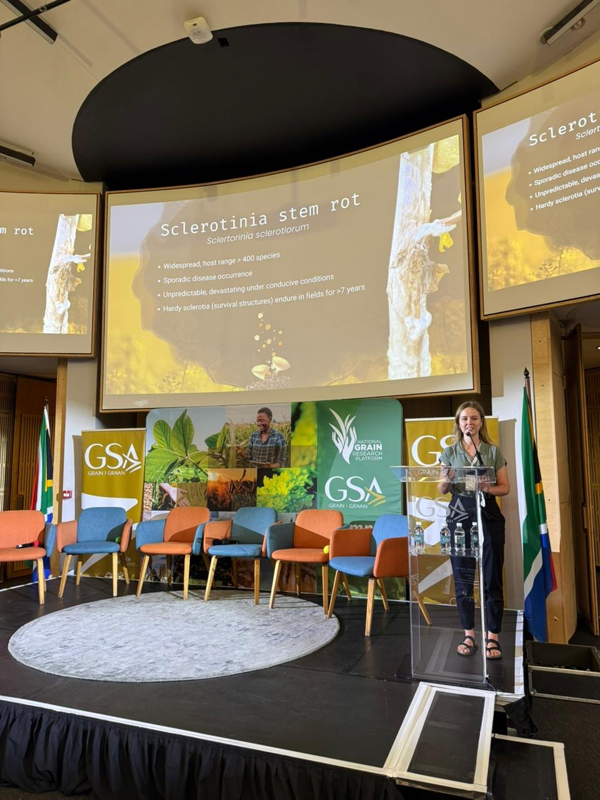
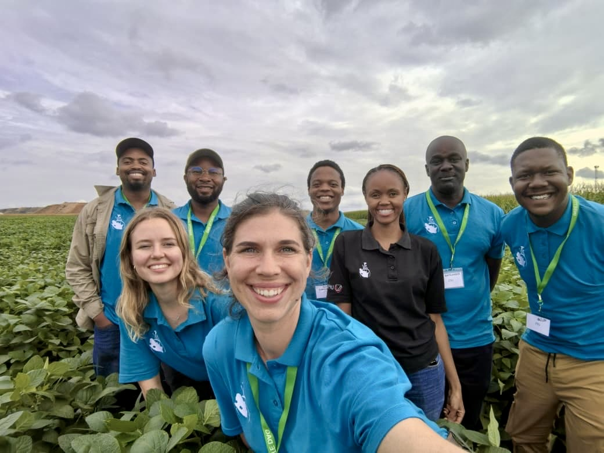

This past week was a meaningful one for the McLab Field Pathology and Epidemiology Group, with opportunities to engage across research, industry, extension, and field work.

We participated in the *National Grain Research Programme*, hosted by [Grain SA](https://www.grainsa.co.za/) in Pretoria, where we had the opportunity to share some of the work and thinking shaping our research group. I presented on how industry partnerships and farmer engagement help shape our research direction at McLab, and how questions from the field often become the foundation for applied research in our programme. You can view the presentation [here](https://osf.io/u63pn/overview).

<figure class="full-image">
  
  <figcaption>
    Attendees of the National Grain Research Programme. Photo: NAMPO (PTY) LTD.
  </figcaption>
</figure>

We are also proud to celebrate [Mariana van Deventer](../team.html#mariana-van-deventer), who presented in the PhD Student Presentation session with her presentation titled "Modelling the risk of Sclerotinia stem rot of canola in the Western Cape of South Africa for improved chemical control" and was awarded first prize. Well done, Mariana, we are very proud of you.

Later in the week, we joined the **AST, Agri-Seed and Technology Farmer Information Day** in Delmas, at our experimental field site. This created a valuable opportunity to share our #SclerotiniaZA research and disease surveillance observations directly with producers.

Alongside these engagement opportunities, we also continued with field activities, including sunflower and soybean screening for head and stem rot caused by _Sclerotinia_. Field assessments this week revealed substantial disease pressure in the soybean, and we observed many apothecia in the field, reinforcing the value of continued surveillance, timely field observations, and strong links between research and practice.

This was a full and encouraging week, one that reflected the kind of applied plant pathology we focus on, research that is strengthened by collaboration, grounded in field realities, and shared with the people it aims to serve.

  <figure class="img-large">
    
    <figcaption>Mariana presenting her research at the National Grain Research Programme.</figcaption>
  </figure>

  <figure class="img-tall">
    
    <figcaption>
      All of us together at the AST Farmer Information Day, from the left Thabiso, Jeremiah (visiting), Mariana, Me, Kwanele, Nomvula, Knowledge and Dumo. 
    </figcaption>
  </figure>

